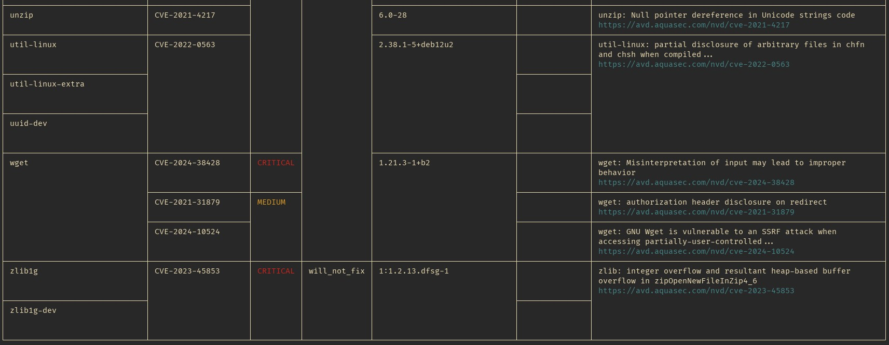

# Securing Linux Containers

## 1. Table of contents

<!--toc:start-->

- [Securing Linux Containers](#securing-linux-containers)
  - [1. Table of contents](#1-table-of-contents)
  - [2. Introduction](#2-introduction)
  - [3. Secrets](#3-secrets)
    - [3.1 Alternatives](#31-alternatives)
      - [3.1.1 Files](#311-files)
      - [3.1.2 Secrets Management Services (kubernetes)](#312-secrets-management-services-kubernetes)
  - [4. Users and groups](#4-users-and-groups)
    - [Setting user and group](#setting-user-and-group)
      - [Containerfile/Dockerfile](#containerfiledockerfile)
      - [Changing user/group arbitrarily on container startup](#changing-usergroup-arbitrarily-on-container-startup)
    - [Additional security](#additional-security)
  - [5. Filesystem](#5-filesystem)
    - [Read-only](#read-only)
    - [Additional Protection with nosuid, noexec, and nodev](#additional-protection-with-nosuid-noexec-and-nodev)
  - [6. Resources limits](#6-resources-limits)
    - [CPU](#cpu)
    - [RAM](#ram)
  - [7. Network](#7-network)
    - [Desktop tools](#desktop-tools)
    - [Kubernetes](#kubernetes)
  - [8. Images](#8-images)
  - [8.1 Building](#81-building)
  - [8.2 Scanning](#82-scanning)
  - [9. Selinux](#9-selinux)

<!--toc:end-->

## 2. Introduction

This document is a collection of simple, very generic tips and best
practices related to security of Linux containers. Contenerization is
considered safer by default, but then one can hear about discovered
vulnerabilities that are primarly bad for applications in containers
(Example: [CVE-2023-49103](https://nvd.nist.gov/vuln/detail/CVE-2023-49103)).
Tips and best practices collected here should help raise awarness about
how to keep containers really secure. Contents are kept container-engine
agnostic, but examples will be based on actual implementations (Podman, k8s).

## 3. Secrets

Secret is the most vulnerable data, as it usually can open access to other
private data. They might also allow modification of the environment, which
means possibilities for further access or many other forms of attack.

> [!WARNING]
> Don't use environment variables for secrets

Container isolation made providing and managing secrets somewhat harder, as
they need to cross the additional barier. This casued the rather dangerous
trend of providing secrets among many other configuration data in form of
environment variables. At first sight it might look like good idea, but when
actually compared to other means of storing secrets it turns out that
environment variables might be much easier to access by attacker, than
for example arbitrary files. [CVE-2023-49103](https://nvd.nist.gov/vuln/detail/CVE-2023-49103)
is only an example of vulnerability which was considered to be more
dangerous for contenerized apps, because of the vulnerability
being based on gaining access to env variables.

### 3.1 Alternatives

#### 3.1.1 Files

Files with secrets are common and broadly supported. With proper setup they can
be also very secure.

- Keep configuration and secret files on entirely different path than other data
- If application runs main process under different user than worker processes
  (worker usually have direct contact with user interaction), the configuration
  should not be readable by the worker process user.
- Depending on the technology used, storage of the secret files inside of a
  container could be temporary/volatile. In kubernetes Secret objects are mounted
  as tmpfs. Example for mounting secret as tmpfs in pod:

```yaml
apiVersion: v1
kind: Pod
metadata:
  name: app
spec:
  containers:
  - name: app
    image: registry.fedoraproject.org/fedora-minimal:latest
    command: [ "sleep", "infinity" ]
    volumeMounts:
      - mountPath: /config
        name: config
  volumes:
  - name: config
    secret:
      secretName: config
```

This produces readonly tmpfs mount inside:

```bash
bash-5.2# df -h /config/
Filesystem      Size  Used Avail Use% Mounted on
tmpfs           4.8G  4.0K  4.8G   1% /config

bash-5.2# ls -la /config/
total 0
drwxrwxrwt. 3 root root 100 Nov  9 14:00 .
drwxr-xr-x. 1 root root  24 Nov  9 14:00 ..
drwxr-xr-x. 2 root root  60 Nov  9 14:00 ..2024_11_09_14_00_47.4065932771
lrwxrwxrwx. 1 root root  32 Nov  9 14:00 ..data -> ..2024_11_09_14_00_47.4065932771
lrwxrwxrwx. 1 root root  18 Nov  9 14:00 secret.conf -> ..data/secret.conf
```

#### 3.1.2 Secrets Management Services (kubernetes)

There are sophisticated tools for secret management and their deployment,
available for kubernetes. For example HashiCorp Vault. It offers dynamic
secrets, secret rotation, and access policies. Such tools are most helpfull in
large environments and infrastructures, where secret management is split
among many people.

## 4. Users and groups

Users and groups are standard mechanisms for security and permissions limiting
in unix-like systems. Contenerization engines usually have possibility to
arbitrarily assign them to the contenerized program process.

> [!NOTE]
> Both user and group can always be specified by numeric id even if no actual
> user or group is assigned to them. When specifying with string name, the user
> or group must exist **inside** of the container (`/etc/passwd`, `/etc/group`)

> [!NOTE]
> Processes of rootless containers or containers with uid/gid mapping have
> different id's inside of container and outside. This can complicate things
> even more, but that also usually greatly increases security.
> In some scenarios such mapping can also cause trouble with files in
> container image, if their id's are out of mapping range.

### Setting user and group

Containers have default user and group specified by Containerfile, but
it can be changed when starting the container.

#### Containerfile/Dockerfile

In Containerfile the user/group assignment might take place many times in
single build. Typical reason for that is to have high privilige (root) during
build, and then set default to unpriviliged user at the end of build, so that
containers will use it by default.

Setting just user to "user1"

```Dockerfile
USER user1
```

Setting both user and group

```Dockerfile
USER user1:group1
```

Setting just group

```Dockerfile
USER :group1
```

#### Changing user/group arbitrarily on container startup

Podman and Docker uses `--user` or shorter `-u` flag to specify both user and
group. The syntax is the same as shown for Containerfile. Example of
setting both user and group to bin, but user is specified with number ID:

```bash
❯ podman run --rm -it --user 1:bin registry.fedoraproject.org/fedora-minimal
bash-5.2$ whoami
bin
bash-5.2$ groups
bin
bash-5.2$ grep ^bin /etc/passwd
bin:x:1:1:bin:/bin:/usr/sbin/nologin
bash-5.2$ grep ^bin /etc/group
bin:x:1:
```

For Kubernetes, the user and group specification is located in pod definition:

```yaml
apiVersion: v1
kind: Pod
spec:
  securityContext:
    runAsUser: 1
    runAsGroup: 1
```

> [!NOTE]
> In kubernetes you can't specify user nor group using string name.
> Only numeric values are allowed.

### Additional security

Linux kernel provides usefull feature - [No New Privileges Flag](https://docs.kernel.org/userspace-api/no_new_privs.html).
If set for process, it prevents the process from gaining more privileges than
parent process. This effectively blocks use of capabilities, and setgid,setuid
flags on files, which are known and powerfull tools for exploitation.

In Podman and Docker, the flag can be enabled using parameter `--security-opt no-new-privileges`

In Kubernetes, there is section related to security context per container:

```yaml
(....)
  containers:
  - name: mycontainer
    securityContext:
      allowPrivilegeEscalation: false
(....)
```

## 5. Filesystem

By default the filesystem security of containers is quite good, specially
when used with other mechanisms like selinux or mapped UIDs/GIDs, but it
still have field for improvement.

### Read-only

Both base filesystem and mounted volumes can be set to readonly.
When using a read-only filesystem, certain directories may still need to be
writable, such as /tmp or /var/tmp. This is where tmpfs (temporary filesystem)
can be used. tmpfs filesystem mounts a temporary filesystem in memory, allowing these
directories to be writable without compromising the overall read-only nature
of the filesystem. The directory will be empty and will vanish on container
shutdown which also increases security, if the temporary data is vulnerable.

Running Podman container with readonly base filesystem using `--read-only`:

```bash
podman run --rm -it --read-only registry.fedoraproject.org/fedora-minimal
```

> [!Note]
> Podman simplifies use of --read-only by automatically creating read-write
> tmpfs mounts inside in places where it is usually needed, like `/dev/shm`,
> `/tmp`, `/run`, etc...

Mounting tmpfs dir with specific size limit to Podman container using `--tmpfs`:

```bash
podman run --rm -it --read-only --tmpfs /tmp:rw,size=64m registry.fedoraproject.org/fedora-minimal
```

Mounting podman volume as read-only is done by specifying `ro` mount option
after `:` separator, for example `--tmpfs /test:ro`, `-v /host/path:/container/path:ro`

On Kubernetes to set base filesystem of a container to read-only, there is
`readOnlyRootFilesystem: true` attribute in container security context. To
mount any volume as read-only, there is attribute `readOnly: true` in mount
section.

Full kubernetes example of read-only base filesystem and example volume:

```yaml
apiVersion: v1
kind: Pod
metadata:
  name: readonly-pod
spec:
  containers:
  - name: mycontainer
    image: registry.fedoraproject.org/fedora-minimal:latest
    command: ["sleep", "infinity"]
    securityContext:
      readOnlyRootFilesystem: true
    volumeMounts:
    - mountPath: /test
      readOnly: true
      name: tmpfs
  volumes:
  - name: tmpfs
    emptyDir:
      medium: Memory
      sizeLimit: 64Mi
```

### Additional Protection with nosuid, noexec, and nodev

To further enhance security, you can use the nosuid, noexec, and nodev mount
options for volumes. They can also be used for tmpfs mounts.

- nosuid: Prevents the execution of set-user-identifier or set-group-identifier programs.
- noexec: Prevents the execution of any binaries on the mounted filesystem.
- nodev: Prevents the use of device files on the mounted filesystem.

Example using Podman:

```bash
❯ podman run --rm -it --read-only --tmpfs /test:nodev,nosuid,noexec registry.fedoraproject.org/fedora-minimal
bash-5.2# mount | grep /test
tmpfs on /test type tmpfs (rw,nosuid,nodev,noexec,relatime,context="system_u:object_r:container_file_t:s0:c240,c646",uid=1000,gid=1000,inode64)
```

## 6. Resources limits

Setting resource limits for containers is required to ensure that no single
container can consume excessive resources, which could impact the performance
and stability of the entire system or neighbour systems.

### CPU

Since there is no virtualization, the cpu is visible with all its cores and
threads inside of a container. Therefore cpu limiting is done by limiting
cpu time using scheduler. Usually the limitation unit is vCPU. In Podman
you can set the limit using `--cpus` flag. For example `--cpus=2` will limit
cpu time to 2/X of total cpu time current host have. In case of cpu with 16
threads this means that container can use up to 12.5% of whole cpu power. This
does not mean assigning the cpu time to specific physical threads, therefore
high load in that container will be loadbalanced on all physical threads,
without allowing to utilize too much of time.

In case of Kubernetes this works the same, limits are specified per container:

```yaml
(....)
spec:
  containers:
  - name: app
    resources:
      limits:
        cpu: "2"
(....)
```

### RAM

Limiting RAM for container looks similar to cpu limiting. Except that
when software inside of a container tries to cross the limits, it will be
handled more brutally - RAM hungry process will be killed. This might be
not that intuitive for application, as here again the app sees all the memory
available in host system, and it does not know about the limits (unless
configured).

Podman have simple flag `--memory` which configures the limit. `--memory=512MiB`
will limit to 512MiB.

Kubernetes works similar:

```yaml
(....)
spec:
  containers:
  - name: app
    resources:
      limits:
        memory: "512Mi"
(....)
```

## 7. Network

For network isolation, Linux containers leverage network namespaces.

A network namespace is a feature provided by the Linux kernel that allows for
the creation of isolated, independent network stacks. Each network namespace
has its own separate set of network interfaces, routing tables, firewall
rules, and other network-related resources. This gives complex possibilities
for network configuration, but it stimulates differences between
container engine implementations.
Additionally rootless containers, which are considered safer, need
to fallback to different network components, with reduced
possibilities, as managing network is strictly root based.

### Desktop tools

Container engines suitable for desktop like Podman usage usually have limited
options for network configuration. They allow to isolate pods from host and
each other with different network addresses pools, and even disabling the
network at all, which is very safe, but very rare.

For such tools there could be few rules that should increase security:

- Don't disable isolation. Isolation makes access harder for remote attacker,
  even if he can access any port on the container host machine.
- When opening ports to access the app from outside, set binding to the least
  accessible but sufficient interface/address. For example If you expect only
  to access the app locally over localhost, you could bind to localhost in
  Podman using flag: `-p 127.0.0.1:8080:8080` to open the port 8080
  only for localhost

### Kubernetes

Kubernetes gives much greater possibilities for both ingress and egress.
Primary tools for that are Network Polcicies, which are implemented via plugins
(therefore they might be not available on some k8s clusters).

Network Policies allow for very accurate limitation of network traffic,
thanks to their possibilities:

- Using labels to select the pods to which the network policy
  applies. This allows you to target specific groups of pods based on their labels.
- Applying network policies across namespaces by selecting
  namespaces based on their labels.
- Defining rules based on specific protocols (TCP, UDP) and ports to allow or deny traffic.
- Support for arbitrary CIDR-formatted network addresses ranges.

Example network policy definition:

```yaml
apiVersion: networking.k8s.io/v1
kind: NetworkPolicy
metadata:
  name: example
spec:
  podSelector:
    matchLabels:
      app.kubernetes.io/name: app1
  policyTypes:
    - Ingress
    - Egress
  ingress:
    - from:
      - namespaceSelector:
          matchLabels:
            kubernetes.io/metadata.name: app
      ports:
      - protocol: TCP
        port: 123
      - protocol: TCP
        port: 456
    - from:
      - ipBlock:
          cidr: 10.43.0.0/16
      - ipBlock:
          cidr: fe80::8cb6:aff8:8dc9:f511/64
      ports:
      - protocol: TCP
        port: 443
  egress:
    - to:
      - namespaceSelector:
          matchLabels:
            kubernetes.io/metadata.name: kube-system
      ports:
      - protocol: UDP
        port: 53
    - to:
      - namespaceSelector:
          matchLabels:
            kubernetes.io/metadata.name: db
      ports:
      - protocol: TCP
        port: 5432
```

## 8. OCI Images

Containers technically don't require images, the base filesystem can be
provided in different way, but OCI images become standard in the industry.
Images are another important element of (in)security in contenerization.
It is crucial to understand basics of that format, as it can for example leak
secrets to the public, if used incorrectly.

## 8.1 Building

It is obvious that one should not hardcode secrets into an image. Unfortunately
less users is aware how not to do that. When building an image, any instruction
that can modify filesystem of the built image, will be saved separately as a
layer. By default each layer is kept in the image, even, when in the end all
contents of some of those layers was removed.

Example of **insecure** Containerfile:

```Dockerfile
FROM registry.fedoraproject.org/fedora-minimal

# Copy secret into the image (bad practice)
COPY secret.txt ./secret.txt

# Use and delete secret (but it's still in a previous layer)
RUN cat secret.txt && rm secret.txt
```

There is a way to modify image-to-be filesystem in much more secure manner,
which also brings other benefits. It is called multi-stage build and, as the
name suggests, contains multiple stages, where only layers of the latest will
be saved in the resulting image.

The Containerfile can look like that:

```dockerfile
# Stage 1: Use secret during the build
FROM registry.fedoraproject.org/fedora-minimal AS builder

WORKDIR /app

# Copy application files
COPY app/ /app/

# Copy the secret into the build stage
COPY secret.txt /app/secret.txt

# Use the secret securely (e.g., configure app)
RUN cat /app/secret.txt && echo "Configuring app with secret" > config.txt

# Removing the secret in this example is needed, because in the next stage
# the /app dir will be copied as a whole
RUN rm /app/secret.txt

# Stage 2: Final image without secrets
FROM registry.fedoraproject.org/fedora-minimal

# Nothing is saved from previous stage
WORKDIR /app

# Copy only the necessary files from the builder stage
COPY --from=builder /app/ /app/
```

This approach also helps keeping the images minimal, without any other
leftovers, which also can improve security.

## 8.2 Scanning

Images can be scanned for vulnerabilities. This is usefull for any type and
source if images, since vulnerabilities appear even in the most basic
components like language interpreters, libC libraries, etc. There are tools
for manual scanning like [trivy](https://github.com/aquasecurity/trivy), and
some registries like [Harbor](https://goharbor.io/) have builting optional 
automatic vulnerability scanning for any stored image.

These tools can provide descriptive analysis of image contents, taking into
account versions of most software stored inside (if supported).

Example fragment of output of trivy scanning a python image:



## 9. Selinux
